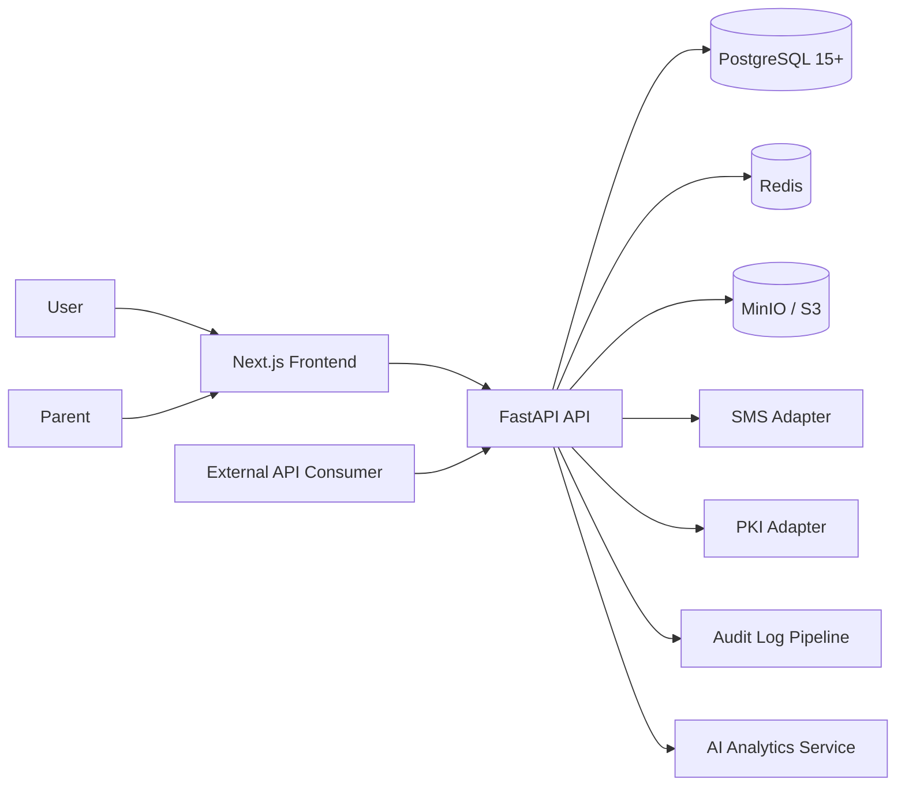

# Architecture Overview

## Monorepo structure

TaMoR uses a monorepo with independent deployable units:

- `backend/`: FastAPI application, Alembic migrations, seed scripts, tests
- `frontend/`: Next.js App Router application with trilingual runtime i18n
- `docs/`: BRD, SRS, ADRs, ER diagram, security architecture

This keeps domain contracts, API evolution, and shared governance artifacts in one reviewable place while still allowing separate runtime deployments.

## Runtime architecture

## Phase 0 implementation decisions

1. **Auth is backend-led**. The frontend never stores refresh tokens in local storage.
2. **Access tokens are RS256 JWTs**. Downstream services can verify without private-key sharing.
3. **Refresh tokens are opaque and hashed**. Rotation plus family revocation mitigates replay.
4. **Mandatory MFA roles are seeded with TOTP in non-production demo environments**.
5. **Locale routing uses URL segments** for public and authenticated screens in Phase 0 to simplify deterministic rendering, testing, and SEO on public pages.

## Multi-tenant readiness

- `center_id` on users and center-scoped claims prepare the authorization model for tenant boundaries.
- Core entities use UUIDs for future federation and safer public exposure.
- Region and mahalla reference tables are modeled as shared district geography dimensions.

## AI microservice reserved path

The `ai-analytics-service` remains a separate deployable unit in the target architecture. Phase 0 establishes:

- RS256 trust model for token verification
- Reserved schema tables for AI outputs and logs
- Documentation contracts for the future service boundary
