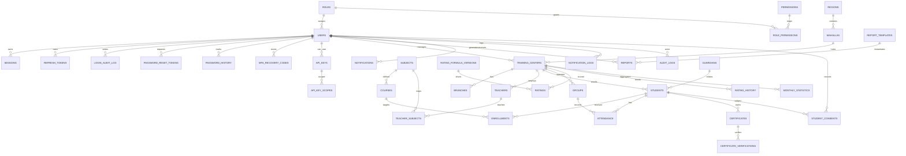

# ER Diagram

```mermaid
erDiagram
  ROLES ||--o{ USERS : assigns
  ROLES ||--o{ ROLE_PERMISSIONS : grants
  PERMISSIONS ||--o{ ROLE_PERMISSIONS : maps
  USERS ||--o{ SESSIONS : owns
  USERS ||--o{ REFRESH_TOKENS : owns
  USERS ||--o{ LOGIN_AUDIT_LOG : writes
  USERS ||--o{ PASSWORD_RESET_TOKENS : requests
  USERS ||--o{ PASSWORD_HISTORY : tracks
  USERS ||--o{ MFA_RECOVERY_CODES : stores
  USERS ||--o{ API_KEYS : can_own
  USERS ||--o{ TRAINING_CENTERS : manages
  REGIONS ||--o{ MAHALLAS : contains
  MAHALLAS ||--o{ TRAINING_CENTERS : hosts
  TRAINING_CENTERS ||--o{ BRANCHES : has
  TRAINING_CENTERS ||--o{ TEACHERS : employs
  TRAINING_CENTERS ||--o{ STUDENTS : enrolls
  TRAINING_CENTERS ||--o{ GROUPS : operates
  SUBJECTS ||--o{ COURSES : defines
  SUBJECTS ||--o{ TEACHER_SUBJECTS : maps
  TEACHERS ||--o{ TEACHER_SUBJECTS : teaches
  STUDENTS ||--o{ ENROLLMENTS : receives
  COURSES ||--o{ ENROLLMENTS : targets
  GROUPS ||--o{ ATTENDANCE : records
  STUDENTS ||--o{ ATTENDANCE : has
  STUDENTS ||--o{ CERTIFICATES : earns
  CERTIFICATES ||--o{ CERTIFICATE_VERIFICATIONS : verifies
  TRAINING_CENTERS ||--o{ RATINGS : scored
  TRAINING_CENTERS ||--o{ RATING_HISTORY : trends
  RATING_FORMULA_VERSIONS ||--o{ RATINGS : drives
  TRAINING_CENTERS ||--o{ MONTHLY_STATISTICS : aggregates
  REPORT_TEMPLATES ||--o{ REPORTS : instantiates
  USERS ||--o{ REPORTS : generates
  USERS ||--o{ NOTIFICATIONS : receives
  USERS ||--o{ NOTIFICATION_LOGS : logs
  USERS ||--o{ AUDIT_LOGS : actor
  USERS ||--o{ STUDENT_CONSENTS : records
  STUDENTS ||--o{ STUDENT_CONSENTS : subject
  GUARDIANS ||--o{ STUDENTS : relates
  API_KEYS ||--o{ API_KEY_SCOPES : scopes
```
