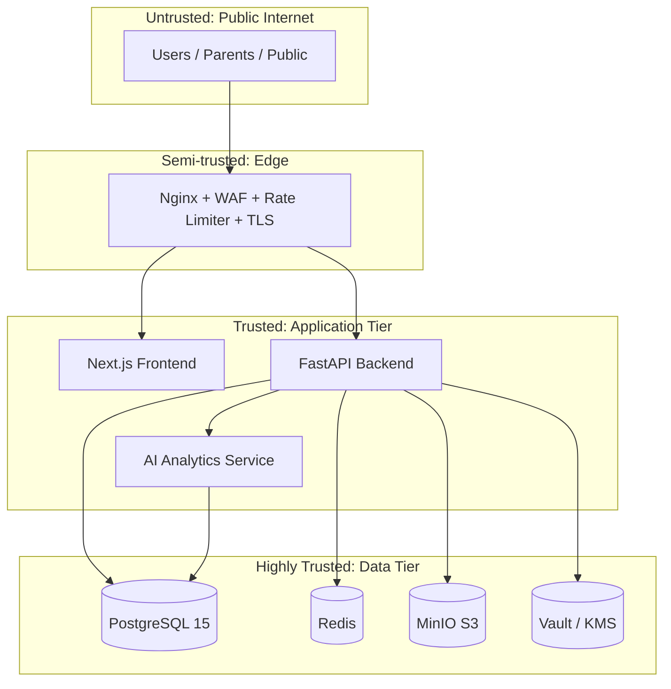

# TMB Production Architecture

## Trust Boundaries
See `docs/threat-model.md` for full STRIDE analysis.

## Phase 0 Components
- Docker Compose for local dev
- GitHub Actions CI
- JWT keys generated at container start (dev); Vault in production
