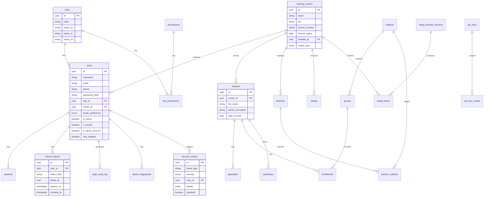

# TMB Entity-Relationship Diagram

```mermaid
erDiagram
    roles ||--o{ users : has
    roles ||--o{ role_permissions : has
    permissions ||--o{ role_permissions : has
    users ||--o{ sessions : has
    users ||--o{ refresh_tokens : has
    users ||--o{ login_audit_log : generates
    users ||--o{ device_fingerprints : has
    users ||--o{ security_events : triggers
    training_centers ||--o{ users : employs
    training_centers ||--o{ students : enrolls
    training_centers ||--o{ teachers : employs
    training_centers ||--o{ ratings : receives
    students ||--o{ guardians : has
    students ||--o{ enrollments : has
    students ||--o{ certificates : earns
    subjects ||--o{ groups : contains
    groups ||--o{ enrollments : includes
    teachers ||--o{ teacher_subjects : teaches
    subjects ||--o{ teacher_subjects : taught
    rating_formula_versions ||--o{ rating_history : produces
    training_centers ||--o{ rating_history : tracked
    api_keys ||--o{ api_key_scopes : scoped

    users {
        uuid id PK
        string username
        string email
        string phone
        string password_hash
        uuid role_id FK
        uuid center_id FK
        enum locale_preference
        boolean is_active
        boolean is_locked
        boolean is_demo_account
        boolean mfa_enabled
    }

    roles {
        uuid id PK
        string code
        string name_uz
        string name_ru
        string name_en
    }

    training_centers {
        uuid id PK
        string name
        string stir
        string license_number
        date license_expiry
        uuid mahalla_id FK
        enum center_type
    }

    students {
        uuid id PK
        uuid center_id FK
        string full_name
        string jshshir_encrypted
        date date_of_birth
    }

    refresh_tokens {
        uuid id PK
        uuid user_id FK
        string token_hash
        uuid family_id
        timestamp expires_at
        timestamp revoked_at
    }

    security_events {
        uuid id PK
        string event_type
        enum severity
        uuid user_id FK
        jsonb details
        boolean resolved
    }
```
