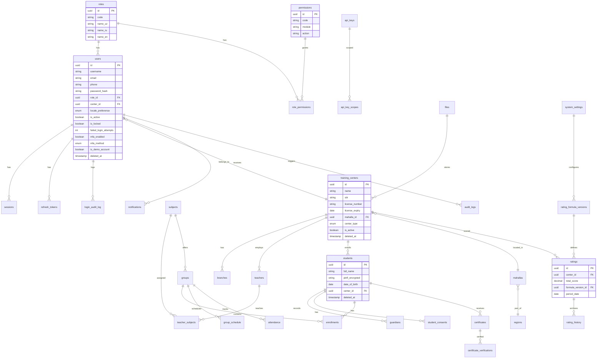

# TaMoR Entity-Relationship Diagram

## Core Auth Tables (Phase 0)

| Table | Purpose |
|-------|---------|
| `users` | Identity records with MFA, locale, lockout state |
| `roles` | 8 system roles with trilingual names |
| `permissions` | Granular module.action permissions |
| `role_permissions` | RBAC mapping |
| `sessions` | Active session tracking |
| `refresh_tokens` | Opaque token rotation with family_id |
| `login_audit_log` | All login attempts (partitioned monthly) |
| `password_reset_tokens` | Password recovery flow |
| `api_keys` | External API consumer HMAC keys |
