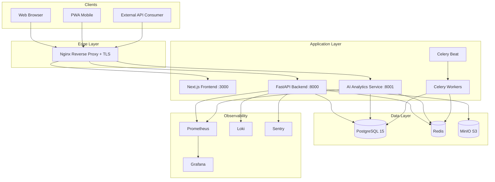

# TaMoR Production Architecture

## Service Responsibilities

| Service | Port | Responsibility |
|---------|------|----------------|
| frontend | 3000 | Next.js SSR/SPA, i18n, girih design system |
| backend | 8000 | REST API, auth, RBAC, business logic |
| ai-analytics | 8001 | ML predictions, trend analysis (JWT verify only) |
| celery-worker | — | Background jobs: ratings, reports, notifications |
| celery-beat | — | Scheduled tasks: daily rating recompute at 03:00 |
| postgres | 5432 | Primary data store |
| redis | 6379 | Cache, sessions, rate limits, Celery broker |
| minio | 9000 | Encrypted file storage (licenses, diplomas) |
| nginx | 80/443 | SSL termination, reverse proxy |

## Deployment Environments

| Environment | Purpose | Database |
|-------------|---------|----------|
| development | Local Docker Compose | Local PostgreSQL |
| staging | Pre-production testing | Staging PostgreSQL |
| production | Live district deployment | Production PostgreSQL (Uzbekistan DC) |

## Disaster Recovery

- RPO ≤ 1 hour (hourly WAL backups)
- RTO ≤ 4 hours
- Daily full backup + encrypted off-site storage
- Quarterly restore testing
