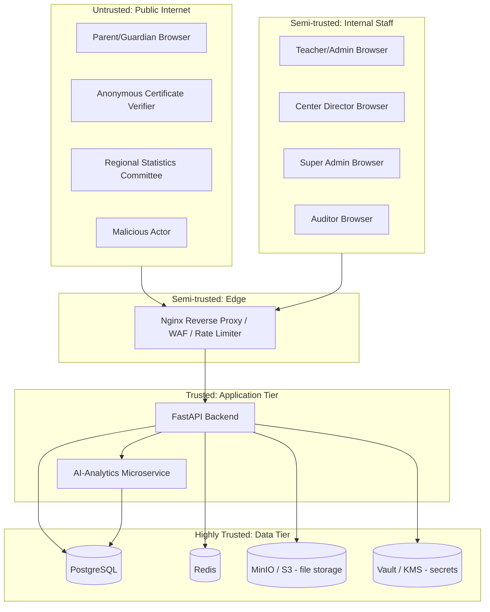

# TMB Threat Model (STRIDE)

> Education Monitoring & Rating Platform — Toyloq District, Samarkand Region  
> Version: 4.0 | Phase 0 deliverable

## Data Flow Diagram

## Trust Boundaries

1. **Internet ↔ DMZ** — Anonymous traffic meets the first filter (rate limiting, TLS).
2. **DMZ ↔ App Tier** — Only authenticated/rate-limited traffic reaches application code.
3. **App Tier ↔ Data Tier** — Backend is the only component with direct DB credentials.
4. **Staff Net ↔ DMZ** — Internal users are untrusted until authenticated (insider threat).
5. **App Tier ↔ App Tier** — AI microservice verifies RS256 JWTs independently; no implicit trust.

## STRIDE Matrix

| # | Category | Threat scenario | Affected component | Mitigation |
|---|---|---|---|---|
| T-S1 | Spoofing | Credential-stuffing against login | Auth endpoint | Breached-password blocklist, per-IP + per-account rate limiting, MFA for privileged roles |
| T-S2 | Spoofing | JWT forgery via weak signing secret | JWT verification | RS256 asymmetric signing; private key in KMS/Vault only |
| T-S3 | Spoofing | AI service impersonation | Service-to-service | RS256 JWT verification; mTLS in production |
| T-T1 | Tampering | `center_id` tampering for horizontal escalation | Students/Centers API | Server-side tenant re-validation on every request |
| T-T2 | Tampering | Certificate PDF/QR forgery | Certificate module | Server-side hash at issuance; verification recomputes server-side |
| T-T3 | Tampering | Refresh token replay after rotation | Refresh flow | Token family invalidation; `security_events` alert |
| T-T4 | Tampering | Bulk rating field manipulation | Rating engine | Anti-gaming anomaly detection; formula versioning |
| T-R1 | Repudiation | PINFL reveal denial | Audit logging | Append-only audit log with explicit reveal action |
| T-R2 | Repudiation | Report generation denial | Reports | Generation metadata logged; footer on exports |
| T-I1 | Information Disclosure | Username enumeration via timing | Auth endpoint | Constant-time login path; generic errors |
| T-I2 | Information Disclosure | IDOR via sequential IDs | REST endpoints | UUID PKs; ownership checks on every fetch |
| T-I3 | Information Disclosure | Sensitive data in error responses | All API | Generic error codes in production; DEBUG=False gate |
| T-I4 | Information Disclosure | Sensitive data in logs | Logging pipeline | Log-scrubbing middleware |
| T-I5 | Information Disclosure | PINFL timing side-channel | PINFL masking | Mask at serialization layer before branching |
| T-D1 | Denial of Service | Certificate verification flood | Public endpoint | 10 req/min/IP; indexed lookup only |
| T-D2 | Denial of Service | Oversized file upload | File upload | Size caps, MIME allowlist, AV scan |
| T-D3 | Denial of Service | Unbounded report generation | Reports | Celery queue with per-user concurrency caps |
| T-E1 | Elevation of Privilege | Missing permission on new endpoint | All endpoints | Default-deny middleware; CI decorator check |
| T-E2 | Elevation of Privilege | SQL injection in filters | List endpoints | ORM only; allowlist sort/filter fields |
| T-E3 | Elevation of Privilege | Compromised dependency | CI/CD | SBOM, pinned hashes, signed images |

## Authentication Abuse-Case Checklist (Section 2A.4)

- [ ] Credential stuffing blocked by rate limiting
- [ ] Username enumeration via timing blocked (constant-time path)
- [ ] Username enumeration via error messages blocked (generic message)
- [ ] Refresh-token replay revokes family + security event
- [ ] JWT `alg` confusion rejected (RS256 only)
- [ ] Horizontal privilege escalation returns 403
- [ ] Vertical privilege escalation returns 403
- [ ] MFA bypass via API blocked (server-side login state machine)

## AI Module Abuse Cases (Section 2A.3)

- Manipulated enrollment data → anomaly detection before model input
- AI service DB pivot → read-only role without PINFL column access
- Alert fatigue DoS → threshold tuning; alert deduplication
